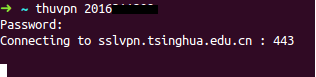

# thu_vpn_linux
Tsinghua Univ. VPN ( Linux version )


## Installation

thu_vpn_linux is installed by running one of the following commands in your terminal. You can install this via the command-line with either `curl` or `wget`.

#### via curl

```shell
sh -c "$(curl -fsSL https://raw.githubusercontent.com/barrykui/thu_vpn_linux/master/install.sh)"
```

#### via wget

```shell
sh -c "$(wget https://raw.githubusercontent.com/barrykui/thu_vpn_linux/master/install.sh -O -)"
```


Then, 

```shell
source ~/.bashrc
```


## Usage 

Run `thuvpn` with the input of `account`:

```
thuvpn 2016xxxxxx
```

Then, input your `password` on info.tsinghua.edu.cn, 



Now, you could surf the tsinghua intranet, like info.tsinghua, lib.tsinghua, et al.


## Other OS system


Tsinghua U. provide Web, Windows and MacOS VPN software, you could download the software from  the [link: http://info.tsinghua.edu.cn/out/help.jsp](http://info.tsinghua.edu.cn/out/help.jsp)


## Acknowledgement
Idea is from [http://lijiancheng0614.github.io/2016/12/31/2016_12_31_thu_vpn/](http://lijiancheng0614.github.io/2016/12/31/2016_12_31_thu_vpn/), thanks to lijiancheng0614.
